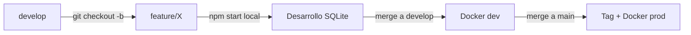

# Manual de Desarrollo Local

## Requisitos

- Node.js 20+
- npm

## Puertos

| Servicio | Puerto |
|----------|--------|
| Backend API | `localhost:4000` |
| Frontend React | `localhost:3000` |
| Base de datos | SQLite (archivo `games.db`) |

> NOTA: Durante feature abierta se usa SQLite exclusivamente. PostgreSQL solo se prueba en Docker dev después del merge a develop.

## Primeros pasos

```powershell
# 1. Clonar ambos repos (si no están)
cd F:\projects\developments\
git clone https://github.com/ferrazp/games-tracker.git
git clone https://github.com/ferrazp/games-tracker-front.git

# 2. Instalar dependencias
cd games-tracker-backend
npm install

cd ..\games-tracker
npm install
```

## Levantar entorno local

En dos terminales PowerShell 7 separadas:

```powershell
# Terminal 1 - Backend (puerto 4000)
cd F:\projects\developments\games-tracker-backend
npm start
```

```powershell
# Terminal 2 - Frontend (puerto 3000)
cd F:\projects\developments\games-tracker
npm start
```

O desde una sola terminal:

```powershell
Start-Process pwsh -WorkingDirectory "F:\projects\developments\games-tracker-backend" -ArgumentList "-NoExit", "-Command", "npm start"
Start-Process pwsh -WorkingDirectory "F:\projects\developments\games-tracker" -ArgumentList "-NoExit", "-Command", "npm start"
```

## Verificar que funciona

```powershell
curl http://localhost:4000/health           # → {"status":"ok",...}
curl http://localhost:4000/consoles          # → lista de consolas
curl http://localhost:4000/games             # → lista de juegos
curl http://localhost:3000                   # → HTML del frontend
```

## Login

```powershell
curl -X POST http://localhost:4000/auth/login `
  -H "Content-Type: application/json" `
  -d '{"username":"admin","password":"1234"}'
# → {"token":"eyJ...", "user":{"username":"admin","role":"admin"}}
```

## Base de datos

### SQLite

| Item | Detalle |
|------|---------|
| Archivo | `games.db` en la raíz del backend |
| Motor | SQLite v3 |
| Cliente | `sqlite3` (callback-based) |
| Migraciones | Automáticas al iniciar el servidor |

### Tablas principales

| Tabla | Contenido |
|-------|-----------|
| `consoles` | 15 consolas (Family Game a PS5 + PC) |
| `games` | Juegos registrados por el usuario |
| `game_catalog` | Catálogo precargado desde IGDB (~150 juegos, top 10 por consola) |

### Consultas útiles

```powershell
# Contar juegos registrados
node -e "import('sqlite3').then(m=>new m.default.Database('games.db').get('SELECT COUNT(*) as c FROM games',[],(e,r)=>console.log(r.c)))"

# Ver consolas disponibles
node -e "import('sqlite3').then(m=>new m.default.Database('games.db').all('SELECT id, name FROM consoles',[],(e,r)=>console.table(r)))"

# Vacuum (recuperar espacio después de borrar muchos registros)
node -e "import('sqlite3').then(m=>new m.default.Database('games.db').run('VACUUM'))"
```

## Flujo de trabajo en feature branch



1. `git checkout develop && git pull`
2. `git checkout -b feature/NOMBRE develop`
3. Desarrollar con `npm start` local (SQLite, nada de Docker)
4. Commits frecuentes: `git push origin feature/NOMBRE`
5. Al terminar, preguntar al usuario antes de mergear a develop

## Scripts disponibles

```powershell
npm start              # Iniciar servidor (SQLite por defecto)
npm run dev            # Igual que npm start
npm run seed:catalog   # Poblar game_catalog desde IGDB
npm test               # Ejecutar tests
```

## Variables de entorno (.env)

| Variable | Default | Descripción |
|----------|---------|-------------|
| `DB_TYPE` | `sqlite` | Tipo de BD (`sqlite` o `postgresql`) |
| `PORT` | `4000` | Puerto del servidor |
| `JWT_SECRET` | — | Secreto para tokens JWT |
| `TWITCH_CLIENT_ID` | — | Cliente IGDB (opcional, para seed) |
| `TWITCH_CLIENT_SECRET` | — | Secreto IGDB (opcional, para seed) |
| `SQLITE_PATH` | `./games.db` | Ruta al archivo SQLite |

## Troubleshooting

| Problema | Causa | Solución |
|----------|-------|----------|
| `EADDRINUSE :::4000` | Otro proceso usando el puerto | Cerrar el node process anterior o cambiar PORT |
| `SQLITE_BUSY` | DB bloqueada por otro proceso | Detener otros node process que usen games.db |
| Frontend no carga juegos | Backend caído o puerto incorrecto | Verificar que `localhost:4000/health` responda |
| Login falla | Backend no iniciado | `npm start` en el backend primero |
